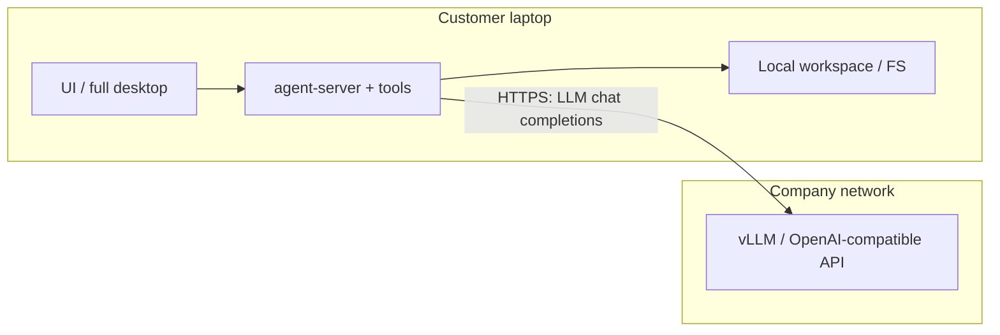

# Hybrid mode (near-term)

> **خلاصه (فارسی):** در Hybrid نزدیک‌مدت، **کل agent-server، ابزارها و workspace روی لپ‌تاپ مشتری** اجرا می‌شود؛ فقط **استنتاج LLM** به سرور شرکت می‌رود. مسیر **Thin Client + پل معکوس** (مغز روی شرکت، فایل/شل روی لپ‌تاپ) در [LOCAL_TOOLS_SIDECAR.md](./LOCAL_TOOLS_SIDECAR.md) است — کلاینت با WebSocket خروجی به `:8000/customer-workspace` وصل می‌شود؛ شرکت به `:18765` مشتری HTTP نمی‌زند.

## What Hybrid means today

**Hybrid = full local agent stack on the customer machine + company LLM over the network.**

| Piece | Where it runs |
|-------|----------------|
| UI (browser or full Electron) | Customer machine |
| agent-server / SDK / automation | Customer machine |
| Tools (terminal, file editor, browser tools, Folder Browser) | Customer machine filesystem |
| LLM inference (vLLM / OpenAI-compatible) | Company server |

Tools **always** execute where the agent-server process runs. There is no supported path today for “remote agent-server that edits the laptop disk.”



## When to use Hybrid vs Thin Client

| Need | Choose | Guide |
|------|--------|-------|
| Agents must see **local project folders** on the laptop; company only hosts the **model** | **Hybrid** (this doc) | You are here |
| Centralize chats/workspaces on a VM; users only open a browser / thin Electron; FS is **on the server** | **Thin Client** | [REMOTE_THIN_CLIENT.md](./REMOTE_THIN_CLIENT.md) |
| Always-on agents, Slack/GitHub webhooks, laptop can sleep | Prefer server agent-server ([SELF_HOSTING.md](./SELF_HOSTING.md) / Thin) | Not Hybrid’s strength |

## Configure the company LLM

### Option A — Manual LLM profile (any Hybrid install)

On each customer install (local agent-server):

1. Open **Settings → LLM Profiles** (local backends).
2. Create or edit a profile:
   - **Model** — whatever your vLLM / gateway advertises (e.g. a served model id).
   - **Base URL** — OpenAI-compatible endpoint, e.g. `https://llm.example.com/v1` or `http://172.16.40.10:8001/v1`.
   - **API key** — whatever the company endpoint requires (or a placeholder if the gateway ignores auth).
3. Select that profile for new conversations.

Optional (server-side / env when launching a local stack), if you already use agent-server LLM env overrides:

```bash
# Exact name can vary by agent-server version; prefer LLM Profiles in the UI for Hybrid.
export OH_LLM__BASE_URL="https://llm.example.com/v1"
```

### Option B — Company-managed login (Hybrid Desktop MVP)

Ship a **full** Hybrid desktop (local agent-server + local workspace) with a baked or env company gateway URL. Users sign in with **username/password**; the app creates one managed local LLM profile and only exposes a **model picker** (no manual `base_url` / `api_key` UI).

```bash
# Dev / source desktop (full local stack — not thin client)
NOVAAGENT_COMPANY_LLM_URL=https://llm.example.com npm run desktop

# Or Vite stack
NOVAAGENT_COMPANY_LLM_URL=https://llm.example.com npm run dev
```

Company packs can also bake `electron/company-llm.json`:

```json
{ "companyLlmUrl": "https://llm.example.com" }
```

**Assumed gateway contract** (company operators):

| Method | Path | Body / headers | Success |
|--------|------|----------------|---------|
| `POST` | `{base}/auth/login` | `{ "username", "password" }` | `{ "access_token", "expires_in"?, "refresh_token"? }` |
| `GET` | `{base}/v1/models` | `Authorization: Bearer <access_token>` | OpenAI-style `{ "data": [ { "id": "…" } ] }` |
| (agent-server → gateway) | `{base}/v1/chat/completions` | OpenAI-compatible; `api_key` = access token | streaming/non-streaming completions |

The Canvas UI talks to the company host **only** for login + model list. Chat completions go from the **local agent-server** to `{base}/v1` via the managed profile. **Workspace, tools, Folder Browser, and settings paths stay on the customer machine** — the company URL is never a Canvas “backend”.

Reachability rules:

- The **customer machine** must be able to reach the LLM URL (VPN, corporate DNS, TLS, firewall).
- The company LLM host does **not** need inbound access to the laptop.
- Do **not** point Thin Client installers at this mode: Thin Client talks to a remote **agent-server**, not only to vLLM.

### Shared-dev / LAN gateway tip (not production Hybrid)

For a **temporary** shared UI on one lab host (ingress already binds all interfaces by default; set `INGRESS_HOST=0.0.0.0` if needed) plus a company LLM shim reachable by other PCs:

```bash
# On the shared host (detect LAN IPv4, prefer 172.16.40.*):
COMPANY_LLM_SHIM_HOST=0.0.0.0 CODE_BOT_API_KEY=… node scripts/company-llm-shim.mjs
NOVAAGENT_COMPANY_LLM_URL=http://<LAN_IP>:18080 PORT=18200 npm run desktop
```

Other PCs open `http://<LAN_IP>:18200`. If the page fails, check host firewall for TCP `18200` / `18080`.

**Production Hybrid is different:** each Windows/Linux PC runs its **own** full desktop (local agent-server + local workspace) and only points `NOVAAGENT_COMPANY_LLM_URL` / baked `electron/company-llm.json` at the **company LLM gateway** LAN/DNS URL. Do not confuse a shared lab UI server with per-laptop Hybrid workspaces.

## How customers install (full local stack — not Thin Client)

Ship or document one of these **full** paths (local Python/agent-server, local workspace):

| Path | Command / artifact |
|------|--------------------|
| Dev / source desktop | `npm run desktop` (builds SPA then Electron with local stack) |
| Packaged Linux desktop | `npm run build:desktop` → full `NovaAgent-*.deb` / AppImage (bundled runtime) |
| Packaged Windows offline | `npm run build:desktop:win` → full Windows dir / zip with bundled Python |
| npm global | `npm install -g @openhands/agent-canvas` then `agent-canvas` |
| Source stack | `npm run dev` / `npm run dev:static` |

**Do not** give Hybrid customers `NovaAgent-Client-*` or `npm run build:desktop:thin` / `desktop:remote`. Those are UI-only shells aimed at a remote agent-server ([REMOTE_THIN_CLIENT.md](./REMOTE_THIN_CLIENT.md)).

After install, either configure an LLM profile manually (Option A) or enable company-managed login with `NOVAAGENT_COMPANY_LLM_URL` / baked `company-llm.json` (Option B). No separate “hybrid mode” binary is required — Hybrid is local agent-server + remote LLM.

## Multi-user notes

- Each customer runs **their own** local agent-server, conversations, secrets, and workspace.
- What is shared is only the **LLM HTTP endpoint** (and whatever auth/quota the company puts in front of it).
- One company vLLM can serve many Hybrid laptops; it does not share chat history between them.
- Contrast Thin Client: one shared `LOCAL_BACKEND_API_KEY` on one agent-server host shares chats/secrets/workspaces among everyone using that key.

## What is *not* this Hybrid doc

True “Cursor-like” reverse hybrid — **agent-server on the company GPU box while tools read/write the laptop filesystem** — is implemented as Thin Client + reverse WebSocket gateway. See [LOCAL_TOOLS_SIDECAR.md](./LOCAL_TOOLS_SIDECAR.md). That path does **not** put Python on the customer PC.

Until that tunnel is connected, use **this Hybrid** definition (local agent-server + remote LLM) when you need a working local disk today without the company gateway.

## Related docs

- [LOCAL_TOOLS_SIDECAR.md](./LOCAL_TOOLS_SIDECAR.md) — Cursor-like Phase 2: sidecar + SidecarWorkspace bridge
- [REMOTE_THIN_CLIENT.md](./REMOTE_THIN_CLIENT.md) — UI-only client → remote agent-server
- [SELF_HOSTING.md](./SELF_HOSTING.md) — harden a VM that hosts the full stack
- [architecture.md](./architecture.md) — runtime modes
- [README.md](../README.md) — quickstart
