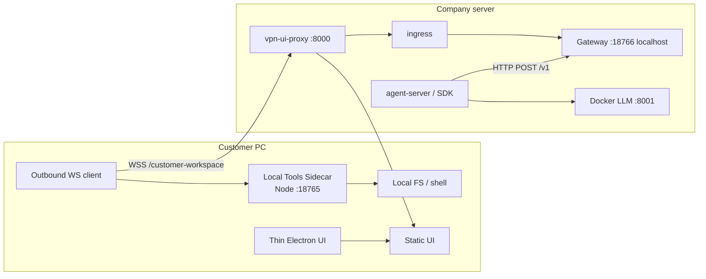
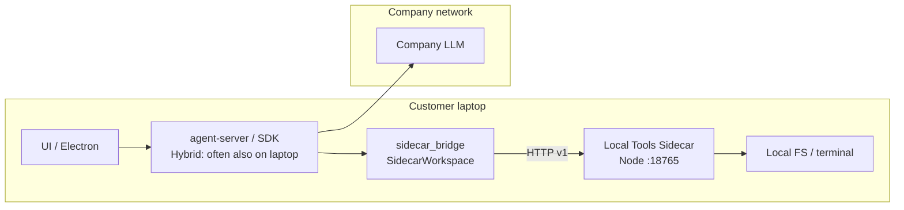

# Local Tools Sidecar (Phase 3 reverse workspace)

> **خلاصه (فارسی):** اسکلت فاز ۱ (Node sidecar روی لپ‌تاپ با توکن و allowlist) یک **پل Python به نام `SidecarWorkspace`** دارد. فاز ۳ یک **گیت‌وی معکوس** اضافه می‌کند: کلاینت نازک از پشت NAT با WebSocket خروجی به در VPN شرکت (`:8000/customer-workspace`) وصل می‌شود؛ agent-server روی شرکت به `127.0.0.1:18766` حرف می‌زند و **HTTP به `:18765` مشتری نمی‌زند**. `file_editor` / `terminal` از طریق `sidecar_bridge` به همین پروتکل هدایت می‌شوند.

## Status (honest)

| Piece | Status |
|-------|--------|
| Sidecar process (Node, no Python/litellm) | **Yes** |
| HTTP + WebSocket JSON protocol `v=1` | **Yes** |
| Path allowlist + session token | **Yes** |
| Reverse WS: customer → company gateway | **Yes** (`scripts/customer-workspace-*`) |
| Thin Client starts sidecar + reverse WS | **Yes** (homedir roots; no Python) |
| Company gateway HTTP for agent-server | **Yes** (`127.0.0.1:18766`) |
| Ingress `/customer-workspace` on VPN `:8000` | **Yes** when `NOVAAGENT_CUSTOMER_WORKSPACE_GATEWAY=1` |
| `SidecarWorkspace` + FileEditor/Terminal proxy | **Yes** when URL+token set |
| UI Folder Browser (`/api/file/home`, `search_subdirs`) | **Best-effort** sidecar proxy; other `/api/file/*` still company-local |

This is the **Cursor-like** path: remote brain, local FS/exec. Near-term [HYBRID.md](./HYBRID.md) (full local agent-server + company LLM) remains available when you want the whole SDK on the laptop.

## Reverse hybrid (Thin Client + company agent-server)



Company **must not** HTTP to the customer `:18765` (NAT). The laptop opens an outbound WebSocket after L2TP.

### Ports (do not steal Docker LLM)

| Port | Role |
|------|------|
| **8000** | VPN door (`vpn-ui-proxy` → ingress `:18200`) |
| **8001 / 8003** | Docker LLM — leave alone |
| **18765** | Customer-local sidecar (loopback on the PC) |
| **18766** | Company-local gateway (loopback; agent-server → sidecar protocol) |
| **18200** | NovaAgent ingress (often unreachable from L2TP; use `:8000`) |

## Architecture (laptop-local Hybrid demo)



### Tool redirection

Agent-server conversations still send `workspace.kind = LocalWorkspace`. `sidecar_bridge` now:

1. Proxies `LocalWorkspace` execute/upload/download through sidecar HTTP.
2. Monkeypatches stock `FileEditorExecutor` and `TerminalExecutor` so chat tools use the sidecar protocol instead of company-local Path/tmux.
3. Best-effort patches `/api/file/home` and `/api/file/search_subdirs` so Folder Browser can list customer roots from `hello`.

Other `/api/file/*` routes (upload/download/archive) still hit the company filesystem.

## Wire protocol

- **Version constant:** `LOCAL_TOOLS_PROTOCOL_VERSION = 1` (field `v` on every message).
- **Transport:** HTTP JSON (`POST /v1`) and WebSocket (`/v1/ws`), both require auth.
- **Health:** `GET /health` → `{ "ok": true, "protocol": 1 }` (no auth).

### Request envelope

```json
{
  "v": 1,
  "id": "req-1",
  "type": "list_dir",
  "params": { "path": "/home/user/project" }
}
```

| `type` | Params | Result |
|--------|--------|--------|
| `hello` | _(none)_ | `{ protocol, roots, host, port }` |
| `list_dir` | `{ path }` | `{ path, entries: [{ name, type, size? }] }` |
| `read_file` | `{ path }` | `{ path, encoding: "utf-8", content }` (size limit default 2 MiB) |
| `write_file` | `{ path, content, create_parents? }` | `{ path, bytes_written }` |
| `exec` | `{ argv: string[], cwd?, timeout_ms? }` | `{ exit_code, stdout, stderr, timed_out }` |

### Response envelope

```json
{
  "v": 1,
  "id": "req-1",
  "type": "result",
  "ok": true,
  "result": { }
}
```

Errors use `"type": "error"`, `"ok": false`, and `"error": { "code", "message" }`.

Common codes: `unauthorized`, `invalid_request`, `path_denied`, `not_found`, `too_large`, `exec_failed`, `timeout`.

### Auth

- Header: `Authorization: Bearer <token>` **or** `X-NovaAgent-Local-Tools-Token: <token>`
- Query (WS / curl convenience): `?token=<token>`
- Env: `NOVAAGENT_LOCAL_TOOLS_TOKEN` — if unset, the process generates one and prints it once at startup.

### Security defaults

- Bind **`127.0.0.1` only** (`NOVAAGENT_LOCAL_TOOLS_HOST`, default `127.0.0.1`).
- Session token required for all `/v1` routes.
- Filesystem ops and `exec` cwd must resolve under **allowlisted roots** (`NOVAAGENT_LOCAL_TOOLS_ROOTS`, colon- or comma-separated). Default: process cwd.
- Path resolution rejects escapes outside roots (`..`, symlink tricks via `realpath` when the path exists).
- `exec` uses `spawn(argv[0], argv.slice(1), { shell: false })` — **no shell string**.
  - The Python bridge wraps shell commands as `["/bin/bash", "-lc", command]` (or `cmd.exe /c` on Windows).

## Phase 2 bridge

| Path | Role |
|------|------|
| `tools/sidecar_bridge/` | Python package on agent-server `OH_EXTRA_PYTHON_PATH` (`tools/`) |
| `SidecarWorkspace` | `LocalWorkspace` subclass; ops via sidecar HTTP |
| `try_install_bridge()` | Import side-effect: monkeypatch when URL+token present |
| `scripts/sidecar-bridge-smoke.mjs` | End-to-end list/read/write/exec demo |
| `tools/sidecar_bridge/README.md` | Registration details |

### Env (bridge)

| Var | Meaning |
|-----|---------|
| `NOVAAGENT_LOCAL_TOOLS_URL` | Sidecar/gateway base URL (`http://127.0.0.1:18765` laptop, `http://127.0.0.1:18766` company gateway) |
| `NOVAAGENT_LOCAL_TOOLS_TOKEN` | Shared bearer token (**required** to enable bridge) |
| `NOVAAGENT_CUSTOMER_WORKSPACE_TOKEN` | Alias for the same token |
| `NOVAAGENT_CUSTOMER_WORKSPACE_GATEWAY=1` | Start company gateway on `:18766` + ingress `/customer-workspace` |
| `NOVAAGENT_LOCAL_TOOLS_SIDECAR=1` | Opt-in spawn on **full** desktop + default URL `:18765` if URL unset |
| `NOVAAGENT_LOCAL_TOOLS_ROOTS` | Allowlisted absolute roots (Thin Client defaults to homedir) |

Launchers (`dev-safe` / `dev-with-automation` / `dev-static` / `dev-extra-backend`) when bridge is enabled:

- Pass `NOVAAGENT_LOCAL_TOOLS_*` into agent-server env
- Append `--import-modules sidecar_bridge`

## How to run

### Sidecar only

```bash
export NOVAAGENT_LOCAL_TOOLS_TOKEN=dev-token
export NOVAAGENT_LOCAL_TOOLS_ROOTS=/tmp/sidecar-demo
mkdir -p "$NOVAAGENT_LOCAL_TOOLS_ROOTS"

npm run sidecar:local-tools
```

Default listen: `http://127.0.0.1:18765` (`NOVAAGENT_LOCAL_TOOLS_PORT`).

### Phase 2 demo (SidecarWorkspace smoke)

```bash
npm run sidecar:bridge-smoke
```

Starts a temp-root sidecar, constructs `SidecarWorkspace`, and asserts list/read/write/exec.

### Hybrid stack with bridge monkeypatch

```bash
export NOVAAGENT_LOCAL_TOOLS_TOKEN=dev-token
export NOVAAGENT_LOCAL_TOOLS_ROOTS="$PWD"
export NOVAAGENT_LOCAL_TOOLS_SIDECAR=1

npm run sidecar:local-tools &
NOVAAGENT_LOCAL_TOOLS_SIDECAR=1 NOVAAGENT_LOCAL_TOOLS_TOKEN=dev-token npm run dev
```

Agent-server logs should show `Imported module: sidecar_bridge` and
`Installed LocalWorkspace → sidecar proxy`.

### Reverse hybrid (company gateway + Thin Client)

On the **company** host (same token on both sides; do not commit it):

```bash
export NOVAAGENT_CUSTOMER_WORKSPACE_GATEWAY=1
export NOVAAGENT_LOCAL_TOOLS_TOKEN=shared-dev-token
# agent-server already using --import-modules sidecar_bridge
npm run customer-workspace:gateway
# or: NOVAAGENT_CUSTOMER_WORKSPACE_GATEWAY=1 npm run dev
```

On the **customer** Thin Client (after L2TP):

```bash
export NOVAAGENT_REMOTE_URL=http://172.16.40.188:8000
export NOVAAGENT_LOCAL_TOOLS_TOKEN=shared-dev-token
npm run desktop:remote
```

Thin Electron always starts the Node sidecar (roots = homedir) and the reverse WS client to `{remote}/customer-workspace`. No Python on the customer pack.

### Electron (full Hybrid desktop, optional sidecar)

```bash
NOVAAGENT_LOCAL_TOOLS_SIDECAR=1 NOVAAGENT_LOCAL_TOOLS_ROOTS=/path/to/project npm run desktop
```

### curl examples

```bash
curl -s http://127.0.0.1:18765/health

curl -s http://127.0.0.1:18765/v1 \
  -H "Authorization: Bearer $NOVAAGENT_LOCAL_TOOLS_TOKEN" \
  -H "Content-Type: application/json" \
  -d '{"v":1,"id":"1","type":"hello"}'
```

## Tests

```bash
npm run test:sidecar-bridge          # Python unit tests (mock HTTP + path map)
npm run sidecar:bridge-smoke         # live sidecar + SidecarWorkspace
npx vitest run __tests__/api/local-tools-sidecar __tests__/api/customer-workspace
npx vitest run __tests__/scripts/sidecar-bridge-env.test.ts
```

## Remaining gaps

- Conversation working_dir should be a **customer absolute path** (Folder Browser home/search_subdirs are proxied; other `/api/file/*` are not).
- Git panels still use company-local git helpers.
- Interactive terminal (`is_input`, tmux session) is a one-shot `exec` over the sidecar.

## Related

- [HYBRID.md](./HYBRID.md) — near-term full local agent + company LLM
- [REMOTE_THIN_CLIENT.md](./REMOTE_THIN_CLIENT.md) — UI → remote agent-server
- [SELF_HOSTING.md](./SELF_HOSTING.md) — harden a company VM
- [tools/sidecar_bridge/README.md](../tools/sidecar_bridge/README.md) — bridge module details
