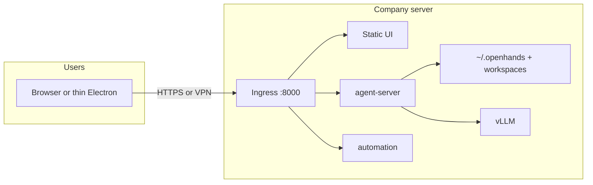

# Remote agent-server + thin frontend

This guide describes the **Thin Client** topology for NovaAgent / Agent Canvas when you want:

- **agent-server + SDK (+ automation)** on a company VM or GPU box (optionally next to vLLM)
- **users** only open a browser (or a thin desktop window) — **no** heavy `.deb` / Windows zip with bundled Python

On this path, the model **and** tools run on the server; the UI is just a client. That is **not** the same as near-term [Hybrid](./HYBRID.md) (local agent-server + company LLM only).

> [!IMPORTANT]
> Conversations, LLM profiles, and secrets live on the **agent-server host**.
> Laptop files and shell are available when the Thin Client reverse workspace
> tunnel is up (outbound WebSocket to `:8000/customer-workspace`). See
> [LOCAL_TOOLS_SIDECAR.md](./LOCAL_TOOLS_SIDECAR.md). Without that tunnel,
> agents only see the **server** filesystem.

## When to use Thin vs Hybrid

| Goal | Use | Doc |
|------|-----|-----|
| Keep agent-server/tools/workspaces on the **company server**; users only open UI | **Thin Client** (this guide) | You are here |
| Keep agent-server/tools/workspaces on the **customer laptop**; only LLM inference on the company server | **Hybrid** | [HYBRID.md](./HYBRID.md) |

Choose Thin when chats and repos should live centrally (or the laptop can sleep while agents keep running on the VM). Choose Hybrid when Folder Browser / tools must see local disks.

## Architecture



| Piece | Where it runs | What users get |
|-------|---------------|----------------|
| Static SPA | Same origin as ingress (preferred) | Browser URL only |
| agent-server / SDK | Server | Nothing to install |
| Workspaces / git | Server filesystem | Pick a folder **on the server** in the UI |
| vLLM / LLM API | Server or LAN | Configured once in LLM Profiles on the server |

## 1. Deploy the server (full stack, public mode)

On the always-on Linux host (see also [SELF_HOSTING.md](./SELF_HOSTING.md)):

```bash
export LOCAL_BACKEND_API_KEY="$(openssl rand -base64 32)"   # save this
# Optional: pin versions via OH_AGENT_SERVER_VERSION / OH_AUTOMATION_VERSION

npx @openhands/agent-canvas --public
# or from a source checkout after `npm run build`:
# node bin/agent-canvas.mjs --public
```

- **`--public`**: session key is **not** baked into the SPA; users paste `LOCAL_BACKEND_API_KEY` on first visit.
- Put **nginx + TLS** (or VPN-only access) in front of `127.0.0.1:8000` as in SELF_HOSTING.md.
- Point an LLM profile at your vLLM OpenAI-compatible base URL (e.g. `http://127.0.0.1:8001/v1`) from **Settings → LLM Profiles** while logged in with the team key.

### Split processes on the server (optional)

```bash
# Terminal A — API only (no static UI in this process)
npx @openhands/agent-canvas --backend-only --public

# Terminal B — static UI + ingress only (points at a backend; default http://127.0.0.1:8000)
# Prefer same-origin full stack instead of this split unless you know you need it.
VITE_BACKEND_BASE_URL=http://127.0.0.1:8000 npx @openhands/agent-canvas --frontend-only
```

Same-origin **full** `--public` stack is simpler for teams: one URL, one key screen, no CORS.

## 2. What to give users (thin client)

### Preferred for teammates: browser only

Send only the HTTPS URL + the session API key (out of band).

Users:

1. Open `https://nova.example.com/`
2. Paste the team `LOCAL_BACKEND_API_KEY`
3. Use NovaAgent in the browser

They do **not** need the Electron `.deb` / Windows zip.

### Customer installers (`.deb` / Windows zip) — NovaAgent Client

Ship a **thin** desktop shell that only opens your server (no local Python/agent-server). Artifacts are named `NovaAgent-Client-*` and are much smaller than the full desktop pack.

**Build (bake your server URL):**

```bash
# Linux .deb + AppImage
NOVAAGENT_REMOTE_URL=https://nova.example.com npm run build:desktop:thin

# Windows portable folder (then zip dist-electron/win-unpacked if needed)
NOVAAGENT_REMOTE_URL=https://nova.example.com npm run build:desktop:thin:win
```

Outputs land in `dist-electron/`:

- `NovaAgent-Client-<version>-amd64.deb`
- `NovaAgent-Client-<version>-x64.AppImage`
- Windows: `dist-electron/win-unpacked/NovaAgent Client.exe` (zip the folder to send)

If `NOVAAGENT_REMOTE_URL` is omitted at build time, the Client asks for the server URL on first launch and saves it under the app userData directory.

**Customer steps:**

1. Install the `.deb` or extract the Windows zip
2. Open **NovaAgent Client**
3. If prompted, enter your server URL
4. Paste the session API key on the public-mode login screen
5. Workspaces/files are on **your server**, not the customer laptop

### Dev: thin Electron without packaging

```bash
NOVAAGENT_REMOTE_URL=https://nova.example.com npm run desktop:remote
```

Aliases: `OH_REMOTE_UI_URL` (same meaning).

## 3. Frontend-only static build (source)

When you build the SPA so it can sit behind the same ingress as the agent-server (no baked localhost backend URL / session key):

```bash
npm run build:frontend-only
# → build/   (same as build:app with VITE_BACKEND_BASE_URL and VITE_SESSION_API_KEY cleared)
```

Serve that `build/` with the published `agent-canvas` static path or your own reverse proxy **same-origin** as `/api` and `/sockets`.

## 4. Conversations and context — what breaks / what does not

| Concern | Behavior |
|---------|----------|
| Conversation history | Stored on the **server**. Survives laptop sleep. Same URL + key → same history. |
| Shared team key | **Everyone shares** chats, secrets, and LLM profiles. Fine for a trusted squad; not multi-tenant SaaS. |
| Laptop project folders | **Not visible** to the agent. Clone or sync repos under e.g. `/workspaces/<user>/` on the server and select them in Folder Browser. |
| Concurrent agents | Same home/workspace can race; prefer per-user subdirs. |

## 5. Per-user isolation (phase 2 patterns)

Local agent-server is **not** multi-tenant in one process. To isolate people:

1. **Separate state dirs / containers** — one container (or systemd unit) per user with its own `HOME` / `OH_CANVAS_SAFE_STATE_DIR` and its own `LOCAL_BACKEND_API_KEY`.
2. **Separate VMs** — heaviest; clearest blast radius.
3. **Accept shared team space** — one key, one `~/.openhands`, documented trust boundary.

Do not expect one shared process + one key to keep private chats.

## 6. Security checklist

- Firewall: only SSH + (optional) 443; keep `:18000` / `:18001` / `:3001` off the public internet.
- Prefer VPN or IP allow-lists on 443.
- Rotate `LOCAL_BACKEND_API_KEY` if it leaks.
- Treat the VM like a machine with production credentials — the agent can shell and read the server FS.

## Related docs

- [HYBRID.md](./HYBRID.md) — local agent-server + company LLM (`base_url`); not Thin Client
- [SELF_HOSTING.md](./SELF_HOSTING.md) — VM hardening, nginx, systemd
- [architecture.md](./architecture.md) — runtime modes
- [README.md](../README.md) — quickstart including `--frontend-only` / `--backend-only`
